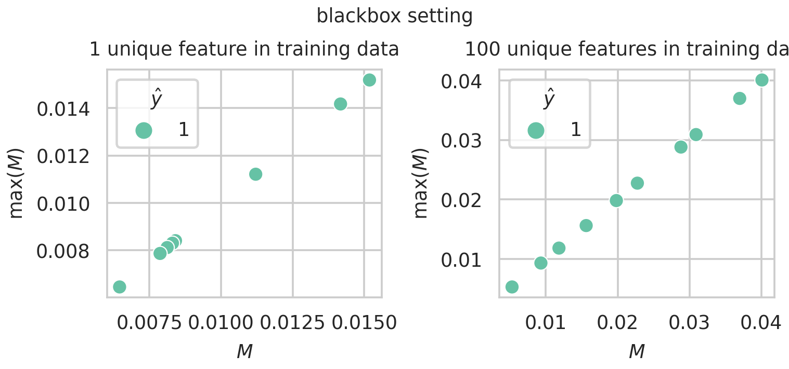

# Installation guide
1. Download and unzip [Celeb-A.zip - Aligned&Cropped Images](http://mmlab.ie.cuhk.edu.hk/projects/CelebA.html) dataset to ```data/```  
1. Install PyTorch - https://pytorch.org/get-started/locally
2. Install dependencies
```
pip install tqdm scikit-learn pandas seaborn scikit-image 
```
3. Setup directories
```
python utils.py
```

# Key Results

## Run Celeb-A memorisation experiment

Run time approximately 1 hour on a Titan RTX GPU.

1. Train Celeb-A models on Celeb-A containing a single random unique feature on a randomly chosen image.
```
python train_celeb_a.py
```
2. Run the memorisation metrics in greybox and blackbox settings.
```
export SETTING=greybox
python eval_celeb_a.py
export SETTING=blackbox
python eval_celeb_a.py
```
3. Results output to ```celeba_greybox.csv```, ```celeba_whitebox.csv```

### Results

We find memorisation of unique features in 8/10 ResNet18 models trained on Celeb A containing a single unique feature.


We find we can detect memorisation of a unique feature in these models without access to the training data. i.e. we perform inference on the models using CIFAR-10




## Rare concepts lead to memorisation experiment

Launch the `toy_memorisation_extra_dim.ipynb` Jupyter notebook.

# Authors

1. John Hartley john.hartley@ed.ac.uk
2. Pedro Sanchez pedro.sanchez@ed.ac.uk
